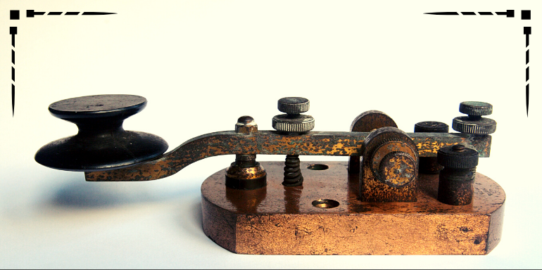

<h1 align="center">CONVERTIDOR MORSE</h1>

<h3> Este proyecto se trata de una herramienta para traducir texto a código morse y visceversa. 
Además, cuenta con un ejercitador visual con diferentes velocidades para la recepción de código morse.
</h3>

<h3> Este proyecto fue originalmente planteado para personal militar capacitado en comunicaciones donde debían ejercitarse en la recepción de código morse.
</h3>

## 🖥️ Descripción
Fue realizaco con Python y librerías Tkinter y Pillow. Luego se generó el ejecutable a través de pyinstaller.

## 🚀 Característcas

- Conversor de texto a Morse y visceversa.
- Guardado de archivos de texto en formato .txt
- Ejercitador visual de recepción Morse.
- 3 opciones de velocidades.

## 👀 Links

